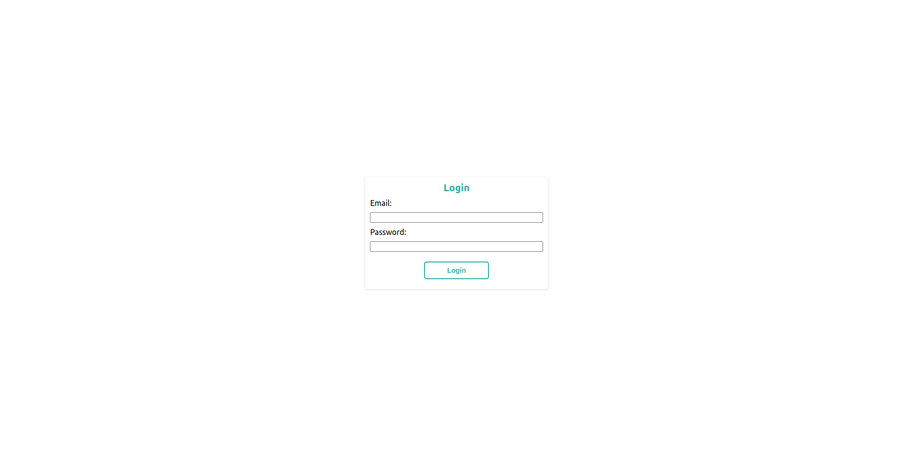

# Ecommerce Admin



A basic ecommerce admin application with frontend and backend. You can also see screenshots in the `ss` folder.

## Features

- Login & Logout
- List all products
- Create products
- Update products
- Delete products

**Note:** Images are being dynamically fetched from [Lorem Picsum](https://picsum.photos/) since the application doesn't have image upload feature for now.

## Backend

### Requirements

- Python 3 (v3.4+)
- Proper [MongoDB](https://www.mongodb.com/) setup (v4.4+)

### Run on Linux

In `backend` folder, copy `.env.template` file contents into a `.env` file and adjust `DB_URI` with your own one.

Run the following commands:

```
$ python3 -m venv venv
$ . venv/bin/activate
$ pip3 install -r requirements.txt
$ python3 app.py
```

The backend will be ready at `http://localhost:5000` with **development** env.

A default admin account will be inserted while application start (if there is no user with an email `admin@company.com`). The credentials are email `admin@company.com` and password `admin`.

## Frontend

### Requirements

- NodeJS v12+

### Run on Linux

In `frontend` folder, copy `.env.template` file contents into a `.env` file.

Run the following commands:

```
$ npm install
$ npm start
```

The frontend will be ready at `http://localhost:3000` with **development** env.
